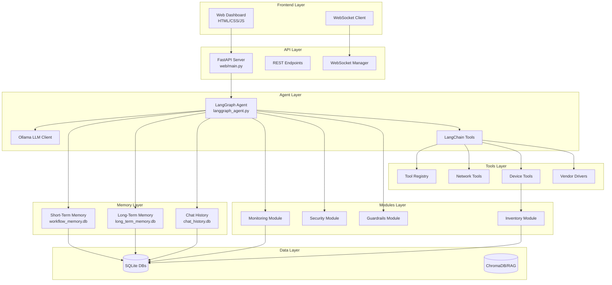
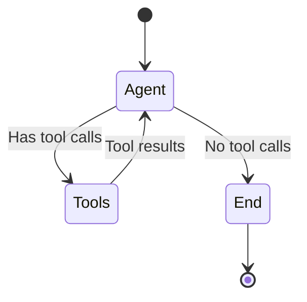
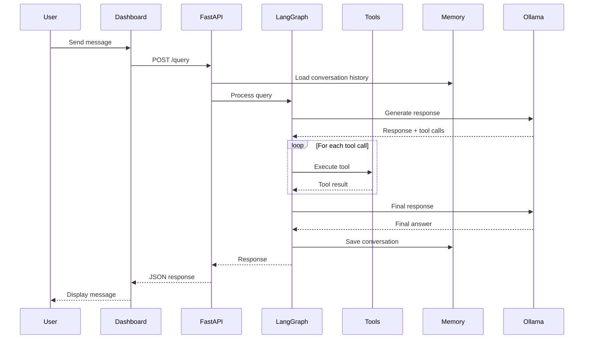
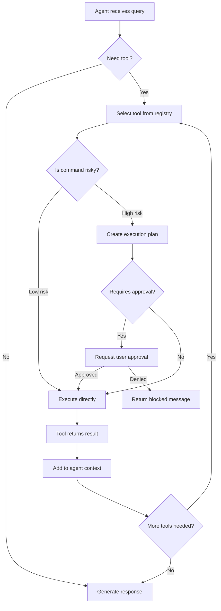
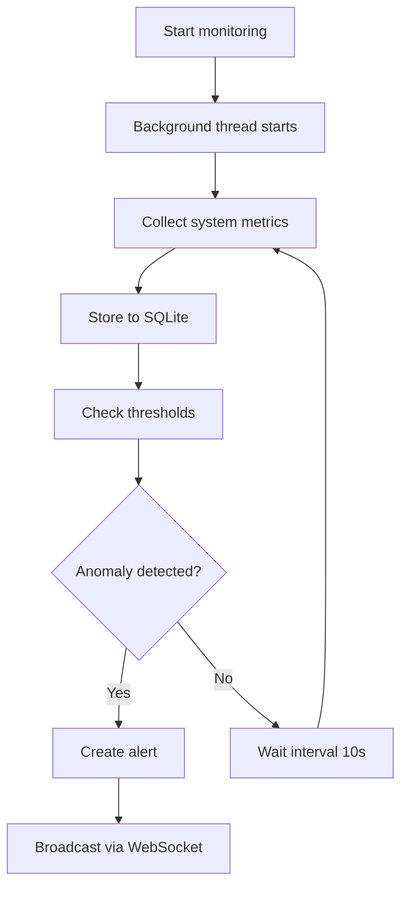
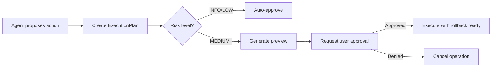
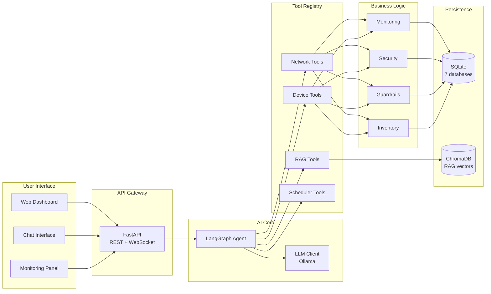

# AgenticNet - Dokumentasi Sistem Lengkap

## Ringkasan Eksekutif

**AgenticNet** adalah sistem AI otonom untuk operasi infrastruktur jaringan yang menggunakan **LangGraph** dengan **Ollama** (LLaMA 3.x). Sistem ini dirancang untuk mengelola, memonitor, dan mengotomasi tugas-tugas jaringan secara cerdas dengan tetap menjaga keamanan dan transparansi.

---

## Arsitektur Sistem



---

## Struktur Direktori

```
agenticNet/
├── main.py                 # Entry point aplikasi
├── config.py               # Konfigurasi global
├── requirements.txt        # Dependencies
├── .env.example            # Template environment variables
│
├── agent/                  # Core AI Agent
│   ├── langgraph_agent.py  # LangGraph agent utama
│   ├── llm_client.py       # Ollama LLM client
│   ├── memory.py           # Short-term workflow memory
│   ├── long_term_memory.py # Long-term memory + solutions
│   ├── chat_history.py     # Conversation persistence
│   ├── langchain_tools.py  # LangChain tool wrappers
│   ├── langchain_*_tools.py # Kategori tools spesifik
│   ├── workflow.py         # Workflow execution engine
│   ├── planner.py          # Multi-step planning
│   ├── scheduler.py        # Scheduled task execution
│   ├── network_topology.py # Network topology mapping
│   ├── rag_knowledge.py    # RAG knowledge base
│   └── report_generator.py # Laporan otomatis
│
├── modules/                # Modul Fungsional
│   ├── monitoring.py       # System & network monitoring
│   ├── inventory.py        # Device inventory management
│   ├── security.py         # Security & compliance
│   └── guardrails.py       # Risk assessment & approval
│
├── tools/                  # Network Tools
│   ├── network_tools.py    # Diagnostic tools (ping, traceroute, etc)
│   ├── tool_registry.py    # Unified tool registration
│   ├── vendor_drivers.py   # Multi-vendor device drivers
│   └── unified_commands.py # Cross-vendor command abstraction
│
├── web/                    # Web Interface
│   ├── main.py             # FastAPI application
│   ├── websocket_manager.py # WebSocket handling
│   ├── templates/          # Jinja2 templates
│   └── static/             # CSS, JS, assets
│       ├── css/
│       └── js/
│
└── data/                   # Persistent Data
    ├── chat_history.db     # Conversation history
    ├── workflow_memory.db  # Workflow memory
    ├── long_term_memory.db # Solutions & patterns
    ├── inventory.db        # Device inventory
    ├── metrics.db          # System metrics history
    ├── config_backups.db   # Configuration backups
    └── chroma_db/          # Vector embeddings (RAG)
```

---

## Komponen Utama

### 1. Entry Point & Konfigurasi

#### [main.py](file:///c:/Users/ASUS/agenticNet/main.py)
Entry point aplikasi yang menjalankan server Uvicorn:
```python
uvicorn.run("web.main:app", host=config.HOST, port=config.PORT, reload=config.DEBUG)
```

#### [config.py](file:///c:/Users/ASUS/agenticNet/config.py)
Konfigurasi global termasuk:
- **Ollama Settings**: Host, model, available models
- **Server Settings**: Host, port, debug mode
- **Agent Settings**: Max reasoning steps, risk threshold
- **System Prompt**: Instruksi lengkap untuk AI agent

```python
class Config:
    OLLAMA_HOST = "http://localhost:11434"
    DEFAULT_MODEL = "gpt-oss:20b"
    MAX_REASONING_STEPS = 10
    RISK_THRESHOLD = 0.7  # Block actions above this risk level
```

---

### 2. LangGraph Agent

#### [langgraph_agent.py](file:///c:/Users/ASUS/agenticNet/agent/langgraph_agent.py)

Implementasi agent berbasis LangGraph dengan:

**State Management:**
```python
class AgentState:
    messages: Annotated[List[BaseMessage], add_messages]
```

**Graph Builder:**
```python
def build_agent_graph(checkpointer=None):
    # Build graph with nodes: agent, tools
    # Edge logic: should_continue -> tools or END
    graph_builder = StateGraph(AgentState)
    graph_builder.add_node("agent", agent_node)
    graph_builder.add_node("tools", tool_node)
    graph_builder.add_conditional_edges("agent", should_continue)
```

**NetworkAgent Class:**
- `invoke(query, thread_id)` - Proses query synchronous
- `ainvoke(query, thread_id)` - Proses query async
- `astream(query, thread_id)` - Stream response chunks
- `get_history(thread_id)` - Ambil conversation history
- `clear_history(thread_id)` - Hapus history



---

### 3. Memory System

AgenticNet memiliki **3 lapisan memori** yang masing-masing disimpan di SQLite:

#### 3.1 Short-Term Memory ([memory.py](file:///c:/Users/ASUS/agenticNet/agent/memory.py))

Menyimpan konteks workflow saat ini:

```python
class WorkflowMemory:
    def remember(type: str, content: Dict) -> str
    def recall(query: str, limit: int) -> List[MemoryEntry]
    def consolidate()  # Move to long-term
    def learn_from_success(goal, steps, tools)
    def learn_from_failure(goal, failed_step, error, recovery)
```

**Database**: `data/workflow_memory.db`
- Tabel `short_term_memory`: Context saat ini
- Tabel `long_term_memory`: Pattern yang dipelajari

#### 3.2 Long-Term Memory ([long_term_memory.py](file:///c:/Users/ASUS/agenticNet/agent/long_term_memory.py))

Menyimpan solusi troubleshooting dan preferensi:

```python
class LongTermMemory:
    def save_solution(problem, solution, category, metadata)
    def find_similar_solutions(query, category, limit)
    def get_top_solutions(category, limit)
    def set_preference(key, value)
    def get_preference(key, default)
    def record_pattern(pattern_type, pattern_data)
```

**Database**: `data/long_term_memory.db`
- Tabel `solutions`: Cached troubleshooting solutions
- Tabel `preferences`: User preferences
- Tabel `patterns`: Learned patterns

#### 3.3 Chat History ([chat_history.py](file:///c:/Users/ASUS/agenticNet/agent/chat_history.py))

Menyimpan percakapan per thread:

**Database**: `data/chat_history.db`
- Thread-based conversation storage
- Persists across server restarts

---

### 4. Tool System

#### 4.1 Tool Registry ([tool_registry.py](file:///c:/Users/ASUS/agenticNet/tools/tool_registry.py))

Central registry untuk semua tools:

```python
class ToolRegistry:
    def register(tool: ToolDefinition)
    def get(name: str) -> ToolDefinition
    def execute(name: str, params: Dict) -> Dict
    def get_langchain_tools() -> List[StructuredTool]
    def get_schema_for_llm() -> str
```

#### 4.2 Network Tools ([network_tools.py](file:///c:/Users/ASUS/agenticNet/tools/network_tools.py))

**Diagnostic Tools:**
| Tool | Fungsi |
|------|--------|
| `ping(host, count)` | Cek konektivitas |
| `traceroute(host)` | Trace network path |
| `dns_lookup(hostname)` | DNS resolution |
| `port_scan(host, ports)` | Scan port terbuka |
| `get_network_info()` | Info jaringan lokal |
| `get_provider_info()` | Info ISP/provider |
| `get_interfaces()` | List network interfaces |
| `get_connections()` | Active connections |
| `measure_latency(hosts)` | Latency measurement |
| `get_bandwidth_stats()` | Bandwidth usage |

#### 4.3 LangChain Tools ([langchain_tools.py](file:///c:/Users/ASUS/agenticNet/agent/langchain_tools.py))

Wrapper LangChain untuk integrasi dengan LangGraph:

```python
@tool
def ping(host: str, count: int = 4) -> str:
    """Ping a host to check connectivity"""
    result = network_tools.ping(host, count)
    return result.output if result.success else f"Error: {result.error}"
```

**Kategori Tools:**
- **Connectivity**: ping, traceroute, check_port, port_scan
- **DNS**: dns_lookup, nslookup
- **Info**: get_network_info, get_provider_info, get_interfaces
- **Monitoring**: get_connections, measure_latency, get_bandwidth_stats
- **Device**: get_device_info, get_interfaces, get_cpu_memory, get_routing_table
- **RAG**: search_knowledge, add_knowledge
- **Scheduler**: create_schedule, list_schedules, cancel_schedule

#### 4.4 Vendor Drivers ([vendor_drivers.py](file:///c:/Users/ASUS/agenticNet/tools/vendor_drivers.py))

Multi-vendor device support:
- Cisco IOS/NXOS
- Mikrotik RouterOS
- Ubiquiti EdgeRouter
- Linux Servers

```python
class UnifiedCommand:
    def get_interfaces(device_ip)
    def get_cpu_memory(device_ip)
    def get_routing_table(device_ip)
    def shutdown_interface(device_ip, interface)  # ⚠️ Requires approval
    def enable_interface(device_ip, interface)    # ⚠️ Requires approval
```

---

### 5. Modules

#### 5.1 Monitoring Module ([monitoring.py](file:///c:/Users/ASUS/agenticNet/modules/monitoring.py))

Real-time system monitoring dengan psutil:

```python
class MonitoringModule:
    def collect_system_metrics() -> SystemMetrics
    def start_collection(interval=10)  # Background collection
    def stop_collection()
    def analyze_trend(metric_name, window_size)
    def detect_anomaly(metric: MetricPoint)
    def get_health_summary()
```

**Metrics Collected:**
- CPU: percent, per-core, count
- Memory: total, used, available, percent
- Disk: usage, read/write speeds
- Network: bytes sent/recv, packets, errors
- Interfaces: per-interface statistics

**Database**: `data/metrics.db`
- Historical metrics storage
- Interface-specific history

#### 5.2 Inventory Module ([inventory.py](file:///c:/Users/ASUS/agenticNet/modules/inventory.py))

Device inventory management:

```python
class InventoryModule:
    def get_device(ip_or_hostname) -> DeviceInfo
    def list_devices(vendor, role, enabled_only)
    def add_device(device: DeviceInfo)
    def update_device(device: DeviceInfo)
    def delete_device(ip_or_id)
    def get_credentials(credential_id) -> DeviceCredentials
    def get_connection_params(device) -> Dict  # For netmiko
```

**Vendor Types:**
- `cisco_ios`, `cisco_nxos`
- `mikrotik_routeros`
- `ubiquiti_edgerouter`
- `linux`

**Device Roles:**
- `router`, `switch`, `firewall`
- `access_point`, `server`, `other`

**Database**: `data/inventory.db`
- Supports NetBox API integration (optional)
- SQLite fallback for local development

#### 5.3 Security Module ([security.py](file:///c:/Users/ASUS/agenticNet/modules/security.py))

Security & compliance checking:

```python
class SecurityModule:
    def analyze_config(config_text, device_type)
    def check_compliance(standard: ComplianceStandard)
    def get_risk_summary()
```

**Compliance Standards:**
- ISO 27001
- NIST Framework
- CIS Benchmarks

**Security Checks:**
- Open risky ports
- Weak protocols
- Default credentials
- Unencrypted traffic
- Missing firewall rules

#### 5.4 Guardrails Module ([guardrails.py](file:///c:/Users/ASUS/agenticNet/modules/guardrails.py))

Human-in-the-Loop approval workflow:

```python
class GuardrailsModule:
    def assess_risk(actions: List[Dict]) -> RiskLevel
    def create_execution_plan(goal, actions) -> ExecutionPlan
    def requires_approval(plan: ExecutionPlan) -> bool
    def request_approval(plan: ExecutionPlan) -> Tuple[bool, str]
    def validate_command(command) -> Tuple[bool, str, RiskLevel]
```

**Risk Levels:**
- `INFO`: Read-only commands
- `LOW`: Minor changes
- `MEDIUM`: Configuration changes
- `HIGH`: Service-affecting changes
- `CRITICAL`: Destructive operations

**Command Classifier:**
```python
class CommandClassifier:
    RISK_PATTERNS = {
        RiskLevel.CRITICAL: [r"(reload|reboot|reset|factory)", r"(delete|erase|format)"],
        RiskLevel.HIGH: [r"(shutdown|disable)", r"(configure|set)"],
        RiskLevel.MEDIUM: [r"(add|remove|modify)"],
    }
    BLOCKED_COMMANDS = ["format flash", "erase nvram"]
```

---

### 6. Web Layer

#### 6.1 FastAPI Application ([web/main.py](file:///c:/Users/ASUS/agenticNet/web/main.py))

**Endpoints Overview:**

| Category | Endpoint | Method | Description |
|----------|----------|--------|-------------|
| **Core** | `/` | GET | Dashboard |
| | `/health` | GET | Health check |
| | `/query` | POST | Query agent |
| | `/stream` | WS | Stream agent response |
| **Conversation** | `/conversation/{thread_id}` | GET | Get history |
| | `/conversation/{thread_id}/clear` | POST | Clear history |
| | `/chat/save` | POST | Save message |
| **Model** | `/models/available` | GET | List models |
| | `/models/current` | GET | Current model |
| | `/models/switch` | POST | Switch model |
| **Workflow** | `/workflow/create` | POST | Create workflow |
| | `/workflow/quick` | POST | Quick mode |
| | `/workflow/{id}` | GET | Workflow status |
| **Infrastructure** | `/infra/devices` | GET/POST | Device management |
| | `/infra/devices/{id}` | GET/PUT/DELETE | Single device |
| | `/infra/monitor/start` | POST | Start monitoring |
| | `/infra/monitor/stop` | POST | Stop monitoring |
| | `/infra/alerts` | GET | Active alerts |
| **Metrics** | `/ws/metrics` | WS | Real-time metrics |
| | `/metrics` | GET | Current metrics |
| | `/metrics/interface/{name}` | GET | Interface metrics |

#### 6.2 WebSocket Manager ([websocket_manager.py](file:///c:/Users/ASUS/agenticNet/web/websocket_manager.py))

Real-time communication:

```python
class WSManager:
    async def connect(websocket: WebSocket)
    async def disconnect(websocket: WebSocket)
    async def broadcast(message: dict)
```

**WebSocket Channels:**
- `/stream` - Agent response streaming
- `/ws/metrics` - Real-time metrics (every 5 seconds)
- `/infra/live` - Infrastructure alerts

---

## Alur Kerja (Workflow)

### 1. Chat Query Flow



### 2. Tool Execution Flow



### 3. Monitoring Flow



---

## Database Schema

### 1. workflow_memory.db

```sql
CREATE TABLE short_term_memory (
    id TEXT PRIMARY KEY,
    type TEXT NOT NULL,
    content TEXT NOT NULL,  -- JSON
    timestamp TEXT NOT NULL,
    relevance_score REAL DEFAULT 1.0
);

CREATE TABLE long_term_memory (
    id TEXT PRIMARY KEY,
    type TEXT NOT NULL,
    content TEXT NOT NULL,
    timestamp TEXT NOT NULL,
    relevance_score REAL DEFAULT 1.0
);
```

### 2. long_term_memory.db

```sql
CREATE TABLE solutions (
    id INTEGER PRIMARY KEY AUTOINCREMENT,
    problem TEXT NOT NULL,
    solution TEXT NOT NULL,
    category TEXT DEFAULT 'general',
    success_count INTEGER DEFAULT 0,
    last_used TEXT,
    created_at TEXT NOT NULL,
    metadata TEXT  -- JSON
);

CREATE TABLE preferences (
    key TEXT PRIMARY KEY,
    value TEXT NOT NULL,
    updated_at TEXT NOT NULL
);

CREATE TABLE patterns (
    id INTEGER PRIMARY KEY AUTOINCREMENT,
    pattern_type TEXT NOT NULL,
    pattern_data TEXT NOT NULL,  -- JSON
    occurrence_count INTEGER DEFAULT 1,
    created_at TEXT NOT NULL,
    last_seen TEXT NOT NULL
);
```

### 3. inventory.db

```sql
CREATE TABLE devices (
    id TEXT PRIMARY KEY,
    name TEXT NOT NULL,
    ip_address TEXT UNIQUE NOT NULL,
    vendor TEXT NOT NULL,
    role TEXT DEFAULT 'other',
    model TEXT,
    location TEXT,
    description TEXT,
    ssh_port INTEGER DEFAULT 22,
    credential_id TEXT DEFAULT 'default',
    enabled INTEGER DEFAULT 1,
    last_seen TEXT,
    created_at TEXT NOT NULL,
    updated_at TEXT NOT NULL
);
```

### 4. metrics.db

```sql
CREATE TABLE system_metrics (
    id INTEGER PRIMARY KEY AUTOINCREMENT,
    timestamp TEXT NOT NULL,
    cpu_percent REAL,
    memory_percent REAL,
    disk_percent REAL,
    network_sent INTEGER,
    network_recv INTEGER,
    process_count INTEGER
);

CREATE TABLE interface_metrics (
    id INTEGER PRIMARY KEY AUTOINCREMENT,
    interface_name TEXT NOT NULL,
    timestamp TEXT NOT NULL,
    bytes_sent INTEGER,
    bytes_recv INTEGER,
    packets_sent INTEGER,
    packets_recv INTEGER,
    errin INTEGER,
    errout INTEGER
);
```

---

## Keamanan & Guardrails

### 1. Risk Assessment

Setiap command diklasifikasikan berdasarkan risiko:

```python
RISK_PATTERNS = {
    RiskLevel.CRITICAL: [
        r"(reload|reboot|reset|factory)",
        r"(delete|erase|format|no\s+)"
    ],
    RiskLevel.HIGH: [
        r"(shutdown|disable)",
        r"(configure|set)"
    ],
    RiskLevel.MEDIUM: [
        r"(add|remove|modify)"
    ]
}
```

### 2. Blocked Commands

Command yang **selalu diblokir**:
- `format flash`
- `erase nvram`
- `delete running-config`

### 3. Approval Workflow



### 4. Iteration Limits

- Max 5 iterations per session
- Prevents infinite loops
- Reset on new conversation

---

## Konfigurasi Environment

### Required Variables

```bash
# .env file
OLLAMA_HOST=http://localhost:11434
OLLAMA_MODEL=gpt-oss:20b
HOST=0.0.0.0
PORT=8000
DEBUG=false

# Device credentials
DEVICE_USERNAME_default=admin
DEVICE_PASSWORD_default=secret
DEVICE_ENABLE_default=enable_secret
```

### Optional Variables

```bash
# NetBox integration
NETBOX_URL=https://netbox.example.com
NETBOX_TOKEN=your-api-token

# Model options
DEFAULT_MODEL=gpt-oss:20b
# Or: glm-4.7-flash:latest
```

---

## Cara Menjalankan

### 1. Setup Environment

```bash
# Clone repository
cd agenticNet

# Setup virtual environment
python -m venv venv
source venv/bin/activate  # Linux/Mac
# atau: venv\Scripts\activate  # Windows

# Install dependencies
pip install -r requirements.txt

# Copy environment file
cp .env.example .env
# Edit .env sesuai kebutuhan
```

### 2. Setup Ollama

```bash
# Install Ollama dari https://ollama.com/download

# Pull model
ollama pull gpt-oss:20b
# atau model lain
ollama pull glm-4.7-flash:latest
```

### 3. Jalankan Server

```bash
python main.py
```

Buka browser: `http://localhost:8000`

---

## Pengembangan & Debugging

### 1. Menambah Tool Baru

Di `tools/network_tools.py`:
```python
def my_new_tool(param1: str, param2: int = 10) -> ToolResult:
    """Tool description"""
    try:
        # Implementation
        return ToolResult(success=True, output="Result")
    except Exception as e:
        return ToolResult(success=False, error=str(e))
```

Di `agent/langchain_tools.py`:
```python
@tool
def my_new_tool(param1: str, param2: int = 10) -> str:
    """Tool description for LLM"""
    result = network_tools.my_new_tool(param1, param2)
    return result.output if result.success else f"Error: {result.error}"
```

### 2. Menambah Device Vendor

Di `tools/vendor_drivers.py`:
```python
class MyVendorDriver:
    def get_interfaces(self, connection):
        # Vendor-specific implementation
        pass
```

### 3. Logging

Sistem menggunakan logging terstruktur:
```python
from agent.logging_config import get_logger
logger = get_logger("module_name")
logger.info("Message")
logger.error("Error occurred", exc_info=True)
```

---

## Dependencies

### Core
- `fastapi` - Web framework
- `uvicorn` - ASGI server
- `langchain`, `langchain-ollama` - LLM framework
- `langgraph` - Agent graph orchestration

### Tools
- `psutil` - System monitoring
- `requests` - HTTP client
- `python-dotenv` - Environment management

### Optional
- `pynetbox` - NetBox API integration
- `chromadb` - Vector database for RAG
- `netmiko` - Network device SSH

---

## Troubleshooting

### 1. Ollama Connection Error
```
Error: Could not connect to Ollama
```
**Solusi**: Pastikan Ollama berjalan (`ollama serve`)

### 2. Model Not Found
```
Error: Model 'xxx' not found
```
**Solusi**: Pull model dengan `ollama pull <model-name>`

### 3. SQLite Threading Issues
```
Error: SQLite objects created in a thread...
```
**Solusi**: Sistem sudah menggunakan `check_same_thread=False`, restart server jika masih error

### 4. WebSocket Disconnect
```
WebSocket connection closed
```
**Solusi**: Normal behavior saat tab browser ditutup. Reconnect otomatis saat tab dibuka kembali.

---

## Diagram Komponen Lengkap



---

*Dokumentasi ini dibuat secara otomatis berdasarkan analisis kode sumber AgenticNet.*
